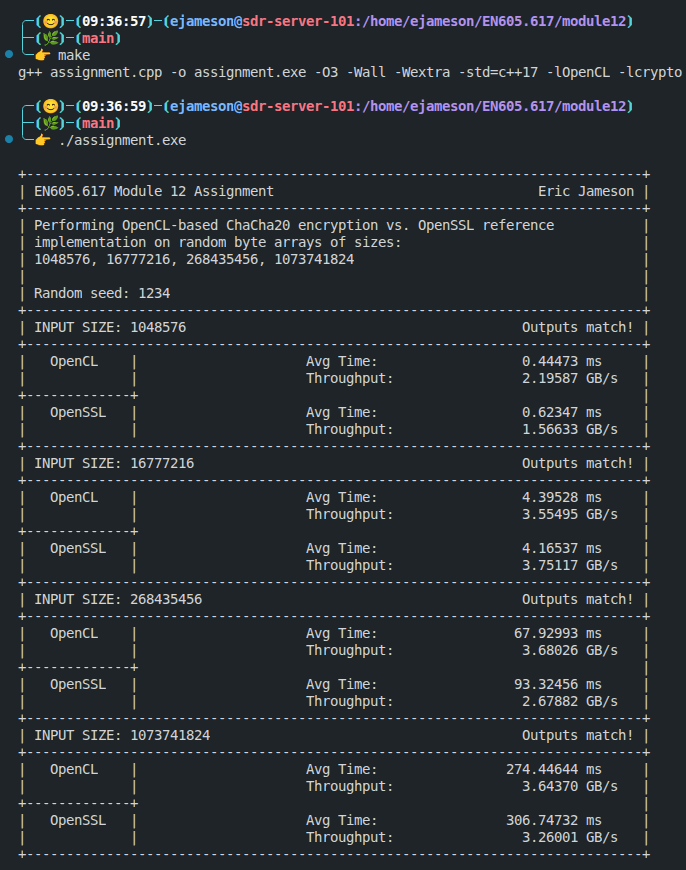
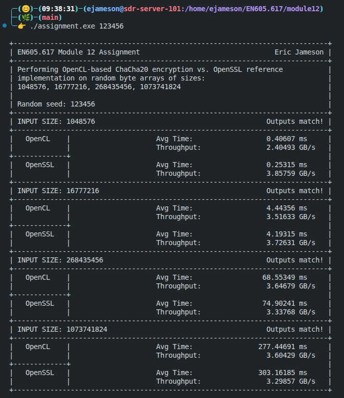

# Module 12 Assignment - Eric Jameson

This folder contains the Module 12 assignment for EN605.617 - Introduction to GPU Programming. Most of the existing content in this folder has been removed so that only the assigment and relevant materials remain.

## Description

### Random Byte Generation

## Implementation Details

### Compilation and Running

To compile the code, simply run

```bash
> make
```

and the provided `Makefile` will compile the code to the executable `assignment.exe`. Then, to run the program, use:

```bash
> ./assignment.exe [RANDOM_SEED]
```

The `RANDOM_SEED` parameter is an optional `unsigned long long`, and defaults `1234ULL`.

### Example Terminal Output

Here is a screenshot showing successful compilation of the assignment and output with default arguments (i.e., no additional command-line argument).



This image shows a successful run of the assignment program with a different random seed passed in.



## Discussion

Overall,

### Successes

### Difficulties
