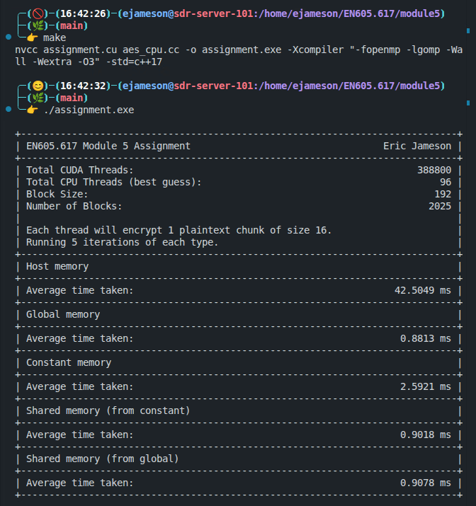
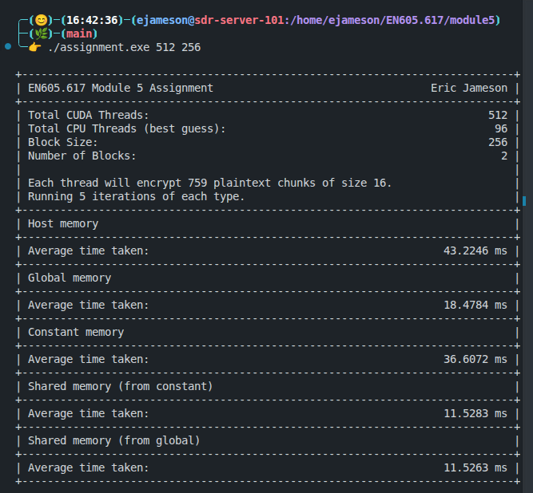

# Module 5 Assignment - Eric Jameson

This folder contains the Module 5 assignment for EN605.617 - Introduction to GPU Programming. Most of the existing content in this folder has been removed so that only the assigment and relevant materials remain.

## Description

For this assignment, I chose to implement the Advanced Encryption Standard (AES) algorithm using CUDA. See [below](#aes-algorithm) for a detailed description of AES. There are a total of 5 distinct implementations of AES contained in the source code of this assignment:

- A CPU-only implementation, accelerated with [OpenMP](https://en.wikipedia.org/wiki/OpenMP);
- A CUDA implementation reading the S-Box and round keys from `__constant__` memory;
- A CUDA implementation reading the S-Box and round keys from `__global__` memory;
- Two CUDA implementations using `__shared__` memory for the S-box and round keys:
  - One where the `__shared__` memory is created from `__constant__` memory; and
  - One where the `__shared__` memory is created from `__global__` memory.

This assignment operates on a PPM image, which is contained in this folder as `jhu.ppm`. For more information on the PPM image format, see [the description in the Module 3 Assignment](../module3/README.md#ppm-image-format).

The AES implementations here operate on only the pixel data of the image, ignoring the magic bytes and header. This is a stylistic choice so that the encrypted pixels can be placed in a separate PPM image for visual inspection. For each encryption implementation, the expected output image is expected to be the same and should match the image shown below.

Input Image                            |  Expected Output Image
---------------------------------------|-------------------------
  |  

## AES Algorithm

The [Advanced Encryption Standard (AES)](https://en.wikipedia.org/wiki/Advanced_Encryption_Standard) is a symmetric-key block cipher, used heavily for the encryption of electronic data. Symmetric-key means that both the sender and the receiver share the same secret key, which is used for both encryption and decryption. A block cipher is a deterministic encryption scheme that operates on fixed-length groups of data, called blocks. The block size of AES is 128 bits, or 16 bytes, and each portion of the algorithm operates on one 16-byte block. For the purposes of this algorithm, we can treat each 16-byte block as a $4 \times 4$ column-major array, known as the **state**:

$$ \begin{bmatrix} b_0 & b_4 & b_8 & b_{12} \\ b_1 & b_5 & b_9 & b_{13} \\ b_2 & b_6 & b_{10} & b_{14} \\ b_3 & b_7 & b_{11} & b_{15} \end{bmatrix}$$

Each block is encrypted by repeating small operations on the state for a set number of rounds. Specifically for this assignment, I have implemented AES-128, meaning that the key is 128 bits long, and the algorithm specification requires 10 rounds of encryption for each block. Although the details of the algorithm itself are beyond the scope of this assignment, a high level description of the algorithm is given here:

1. `KeyExpansion`: round keys are derived from the secret key and a series of "round constants" for a total of 11 128-bit keys (the original key + 10 round keys).
2. `AddRoundKey`: each byte of the state is combined with a byte of the key using the `XOR` operation.
3. For 9 rounds:

    - `SubBytes`: A substitution where each byte of the state is replaced with a different byte from a lookup table, known as the S-Box.
    - `ShiftRows`: A transposition, where each row of the state is shifted by a different number of places.
    - `MixColumns`: A mathematical operation on each column of the state using a specific type of multiplication.
    - `AddRoundKey`
4. Final Round:

    - `SubBytes`
    - `ShiftRows`
    - `AddRoundKey`

After the final round, the state is considered to be encrypted.

### Compilation and Running

To compile the code, simply run

```bash
> make
```

and the provided `Makefile` will compile the code to the executable `assignment.exe`. Then, to run the program, use:

```bash
> ./assignment.exe [TOTAL_THREADS] [BLOCK_SIZE]
```

The `TOTAL_THREADS` and `BLOCK_SIZE` parameters are optional, and default to 388800 and 192, respectively.

### Implementation Details

The supplied image is of size $1920 \times 1080\times 3 = 6220800$ bytes. Because of the 16-byte block size, this means there are a total of $6220800/16=388800$ blocks to encrypt. In each of the implementations described above, each CUDA thread (or CPU thread in the case of the CPU-only implementation) is responsible for encrypting one block at a time. This leads to two possible scenarios:

1. $\geq 388800$ threads are allocated. In this case, the first $388800$ threads will perform the entirety of the encryption and the rest will remain idle.

2. $< 388800$ threads are allocated. In this case, one thread may be responsible for encrypting multiple blocks, and will continue encrypting blocks until the entire image is encrypted.

After running the program, 5 images will be created, one for each implementation:

- `encrypted_host.ppm`
- `encrypted_constant.ppm`
- `encrypted___global.ppm`
- `encrypted_shared_g.ppm`
- `encrypted_shared_c.ppm`

## Example Terminal Output

Here is a screenshot showing successful compilation of the assignment and output with default arguments (i.e., no additional command-line arguments).



This image shows a successful run of the assignment program with a number of threads smaller than the image size.



This image shows a successful run of the assignment program with a number of threads larger than the image size, and a different block size.


This final image shows a successful run of the assignment program with a block size that does not evenly divide the number of threads. This is indicated by a message and the total number of threads being rounded up so that it is evenly divisible by the block size.


## Verification of Results

In order to verify the correctness of my implementations, I took two approaches. First, I compared each of the CUDA-based encyption images byte-by-byte with the CPU-only implementation using the Unix `cmp` command.

Secondly, I wanted to test my implementations against something that I did not write. To this end, I compared the encrypted pixels of my `encrypted_host.ppm` (excluding the header) byte-by-byte with [OpenSSL](https://www.openssl.org/), an open source software library used for secure communications in a variety of contexts. First, I extracted both the unencrypted pixel data and the encrypted pixel data into standalone `.bin` files using the Unix `dd` command:

```bash
> dd if=jhu.ppm of=pixels.bin bs=1 skip=17
> dd if=encrypted_host.ppm of=encrypted_pixels.bin bs=1 skip=17
```

All this does is copy the contents of the file designated `if` to the file designated `of`, skipping the first 17 bytes, which is size of the PPM image header.

Then, I encrypted the pixel data using OpenSSL:

```bash
> openssl enc -aes-128-ecb -K $KEY -nosalt -nopad \
    -in pixels.bin -out openssl_encrypted.bin
```

where `$KEY` is the key I defined for this assignment. Finally, I did one last `cmp` command to ensure that `openssl_encrypted.bin` and `encrypted_pixels.bin` were byte-wise equivalent. This entire process is documented in the provided [`verify.sh`](./verify.sh) file, and can be executed using

```bash
> ./verify.sh
```

Note that the `dd` utility is relatively slow, so the verification takes roughly 60 seconds.

## Discussion

I
