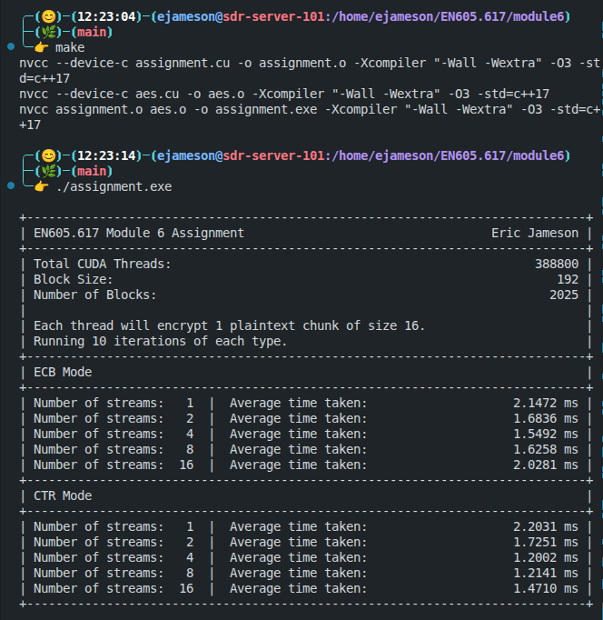
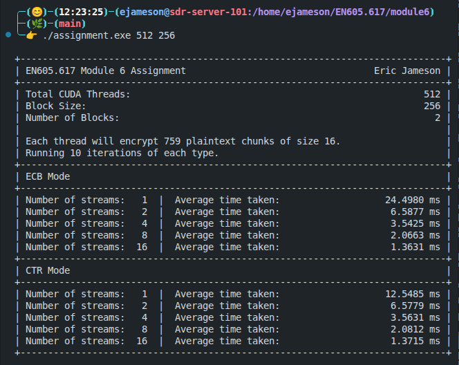
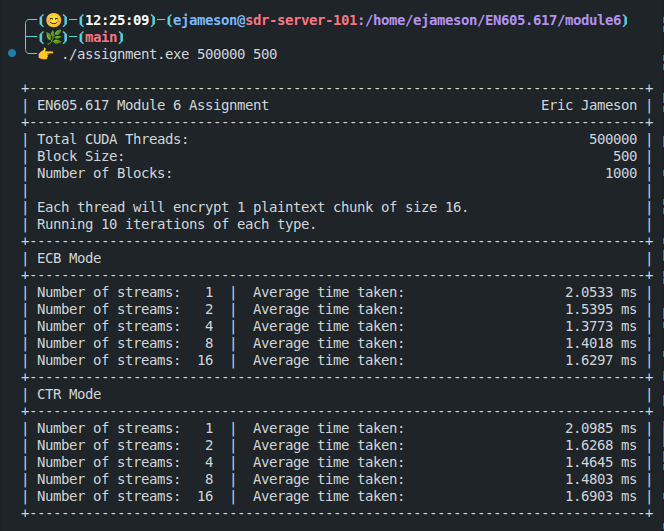
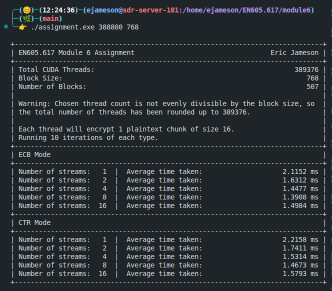
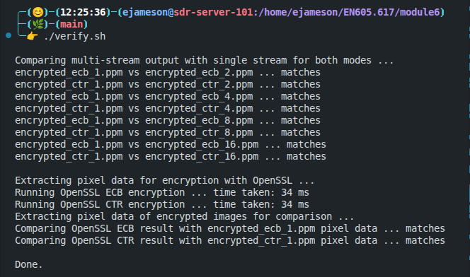

# Module 6 Assignment - Eric Jameson

This folder contains the Module 6 assignment for EN605.617 - Introduction to GPU Programming. Most of the existing content in this folder has been removed so that only the assigment and relevant materials remain.

## Description

In keeping with the theme of my [Module 5 Assignment](../module5/README.md), this assignment extends my implementation of AES to use CUDA streams and events, as well as an additional encryption mode. See [below](#aes-modes-of-operation) for a detailed description for the two modes of operation.

For each mode, the same encryption is run multiple times with various numbers of CUDA streams. Specifically, each mode will run 10 times each using 1, 2, 4, 8, and 16 streams, computing the average time taken in each configuration. This timing data is reported in the [terminal output](#example-terminal-output).

Once again, this assignment operates on a PPM image, which is contained in this folder as `cuda.ppm`. For more information on the PPM image format, see [the description in the Module 3 Assignment](../module3/README.md#ppm-image-format).

The AES implementations here operate on only the pixel data of the image, ignoring the magic bytes and header. This is a stylistic choice so that the encrypted pixels can be placed in a separate PPM image for visual inspection.

## AES Modes of Operation

### Electronic Codebook Mode

In the Module 5 assignment, AES encryption was done using Electronic Codebook mode, or ECB. This means that each block is encrypted independently of all other blocks, with no shared state. Mathematically, ECB mode is described as

```math
C_i = \mathrm{AES}_K(P_i),
```

where $P_i$ is the $i$-th block of plaintext, $C_i$ is the $i$-th block of ciphertext, and $\mathrm{AES}_K(\cdot)$ is the AES encryption function with secret key $K$. As in the previous assignment, our key is 128 bits (16 bytes) long, so the complete name of this implementation of AES ECB encryption is `AES-128-ECB`. Note that the mathematical formulation above implies that identical blocks of plaintext will encrypt to identical blocks of cipher text.

Consider the following input image:


Due to the large areas of identical pixels, this image encrypted with AES ECB mode will also show large areas of identical encryption, as shown in the output:


Note that the key features of the image are still visible. Due to this behavior of encrypting identical blocks in the exact same way, ECB mode is generally considered insecure.

### Counter Mode

An alternative to ECB mode is known as Counter mode (CTR). Instead of encrypting the plaintext directly, AES CTR mode encrypts a piece of data treated as a 128-bit constant, and then combines this encrypted block with the plaintext using XOR. The constant is then changed to encrypt the next block. Mathematically, this can be described as

```math
C_i = AES_K(n\|g(i)) \oplus P_i,
```

where now $n$ is a 64-bit nonce (or "number used once", also known as an initialization vector or IV), $\|$ denotes concatenation, $g(i)$ is any function of $i$ that produces a 64-bit output, and $\oplus$ is XOR. Although the formal specification of CTR requires only that $g(i)$ is guaranteed to not repeat for a long time, typically an "increment-by-one" counter is used, i.e., $g(i) = i$. When encrypting the same input image using CTR mode, we obtain the following pseudo-random output:


### Compilation and Running

To compile the code, simply run

```bash
> make
```

and the provided `Makefile` will compile the code to the executable `assignment.exe`. Then, to run the program, use:

```bash
> ./assignment.exe [TOTAL_THREADS] [BLOCK_SIZE]
```

The `TOTAL_THREADS` and `BLOCK_SIZE` parameters are optional, and default to 388800 and 192, respectively.

### Implementation Details

When running the program, each mode will encrypt the same input image using 1, 2, 4, 8, and 16 CUDA streams. For ECB mode, the single stream encryption is roughly the same as the implementation in the Module 5 assignment.

After running the program, 10 images will be created, one for each combination of cipher mode and CUDA stream count, with filenames of the format `encrypted_{ecb,ctr}_{1,2,4,8,16}.ppm`.

Finally, timing data for each of the 5 implementations is shown. Each implementation is run for 10 iterations (with one additional "dry run" before timing begins) and the average time taken is reported in the terminal output.

## Example Terminal Output

Here is a screenshot showing successful compilation of the assignment and output with default arguments (i.e., no additional command-line arguments).



This image shows a successful run of the assignment program with a number of threads smaller than the image size.



This image shows a successful run of the assignment program with a number of threads larger than the image size, and a different block size.



This final image shows a successful run of the assignment program with a block size that does not evenly divide the number of threads. This is indicated by a message and the total number of threads being rounded up so that it is evenly divisible by the block size.



## Verification of Results

In order to verify the correctness of my implementations, I took two approaches, similar to the previous assignment. First, I compared each of the multi-stream encyption images byte-by-byte with the single-stream implementation using the Unix `cmp` command.

I additionally compared the encrypted pixels of the single-stream implementation (excluding the header) byte-by-byte with OpenSSL's `aes-128-ecb` and `aes-128-ctr` encryption commands. This entire process is documented in the provided [`verify.sh`](./verify.sh) file, and can be executed using

```bash
> ./verify.sh
```

Example output from the `verify.sh` is shown below:



## Discussion

I had two main takeaways from the use of CUDA events and streams from this assignment.

- First, as shown in the output from using 512 threads with a block size of 256, doubling the number of streams essentially doubled the throughput of each encryption mode. This lines up very well with my intuition, as adding twice as many streams essentially halves the workload of each thread. Instead of 256 threads being responsible for encrypting half of the input data, now they are only responsible for a quarter, then and eighth, and so on.
- For larger numbers of threads, there are sometimes diminishing returns or even negative returns for adding more streams. I believe this is because at some point, the overhead of copying data between the host and the different streams becomes a larger proportion of the overall processing, thus eliminating the benefit of the stream pipelining.

Overall, using CUDA streams to process multiple streams of data and CUDA events to synchronize between the multiple streams offers a nice approach to increase performance, and the ability to configure a number of streams will likely make its way into my final project.
