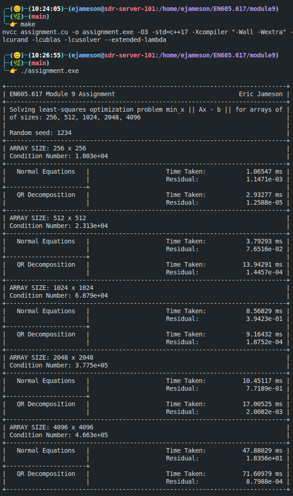
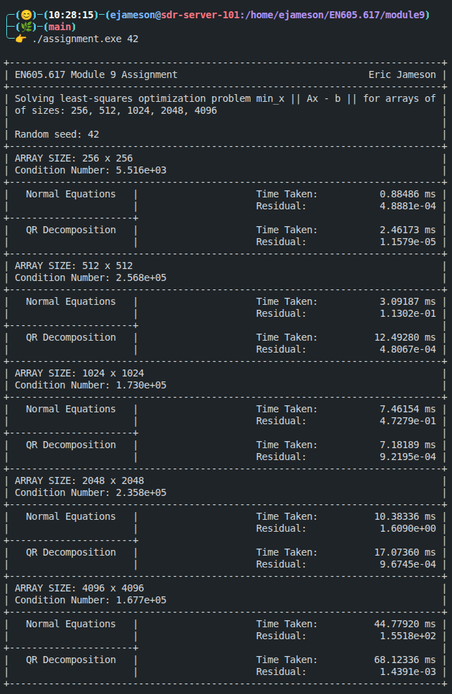

# Module 6 Assignment - Eric Jameson

This folder contains the Module 9 assignment for EN605.617 - Introduction to GPU Programming. Most of the existing content in this folder has been removed so that only the assigment and relevant materials remain.

## Description

In many scientific applications, we are given a system of linear equations of the form $Ax =b$ where

- $A\in \mathbb{R}^{n\times n}$ is a matrix,
- $x\in\mathbb{R}^n$ is the unknown vector, and
- $b \in \mathbb{R}^n$ is a known vector.

However, due to noise, or measurement error, an exact solution may not exist or may be numerically unstable. In such cases, it is more appropriate to minimze the error:

```math
\min_x \|Ax-b\|_2.
```

This is known as the [linear least squares problem](https://en.wikipedia.org/wiki/Linear_least_squares), and it arises in many applications, including signal processing and machine learning. Two common approaches to solving the least squares problem were implemented and compared in this assignment.

### Random Number Generation

Using cuRAND, random matrices $A$ and random vectors $b$ were generated with $n = 256, 512, 1024, 2048, 4096$. These matrices are essentially what defines the performance of each algorithm.

### Normal Equations

The least-squares problem can be reformulated by setting the gradient of the objective function equal to zero:

```math
\nabla\|Ax-b\|^2_2 = 0
```

This can be restated as $A^T A x = A^T b$, known as the _normal equation_. This is now a standard system of equations that can be solved using [LU decomposition](https://en.wikipedia.org/wiki/LU_decomposition).

It is important to note that this method is prone to numerical instability. The [condition number](https://en.wikipedia.org/wiki/Condition_number) of a matrix, which described how ill-conditioned a matrix is, is squared, since $\kappa(A^TA) = \kappa(A)^2$. This leads to large residuals as the size of the matrix increases.

The normal equation method was implemented using cuBLAS and cuSOLVER, in which the workflow is:

1. Compute $A^TA$
2. Compute $A^T b$
3. Solve $(A^T A)x = A^Tb$

### QR Decomposition

A more numerically stable approach uses the [QR decomposition](https://en.wikipedia.org/wiki/QR_decomposition) of $A$, i.e. $A = QR$, where

- $Q \in \mathbb{R}^{n\times n}$ is orthogonal, and
- $R \in \mathbb{R}^{n\times n}$ is upper triangular

This reduces the problem to solving the system $Rx = Q^T b$, which can be efficiently solved via back-substitution. This approach is much more numerically stable as it does not square the condition number of the original matrix $A$.

The QR decomposition method was also implemented using cuBLAS and cuSOLVER, in which the workflow is:

1. Compute the $QR$ factorization of $A$
2. Compute $Q^T b$
3. Solve $Rx = Q^Tb$

### Residual Computation

To evaluate solution quality, we compute the residual $\|Ax-b\|_2$. This was implemented using cuBLAS to compute $Ax$, and then Thrust for elementwise operations and reduction.

### Condition Number Analysis

## Implementation Details

### Compilation and Running

To compile the code, simply run

```bash
> make
```

and the provided `Makefile` will compile the code to the executable `assignment.exe`. Then, to run the program, use:

```bash
> ./assignment.exe [RANDOM_SEED]
```

The `RANDOM_SEED` parameter is an optional `unsigned long long`, and defaults `1234ULL`.

### Example Terminal Output

Here is a screenshot showing successful compilation of the assignment and output with default arguments (i.e., no additional command-line argument).



This image shows a successful run of the assignment program with a different random seed passed in. Note the large residual in the case of $n=4096$ for the normal equation solution.



## Discussion
